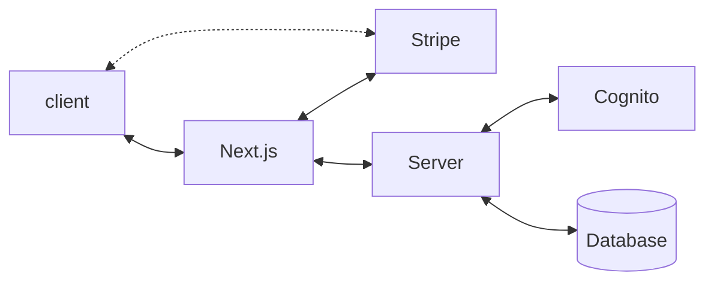

Two besties creating stuff together

### Ops :robot:

 

- [Terragrunt](https://github.com/besties2moon/infrastructure-modules)

  
  
  
    

### Repositories

 

- [Form Backend](https://github.com/besties2moon/form-frontend)
- [Form Frontend](https://github.com/besties2moon/form-backend)
- [Infrastructure Live](https://github.com/besties2moon/infrastructure-live)

##### Creation

First create infra-live, then form-frontend, then form-backend.

The infra-live creates a certificate used by front and back.
The front create a record that is necessary for the back.

##### Deletion

First destroy form-backend and form-frontend, then infra-live

The infra-live has a certificate that has to be removed last.
Manual destroy from back and front will also remove infra-live.

##### Form-frontend
  It uses a [Terraform registry](https://registry.terraform.io/modules/milliHQ/next-js/aws/latest) for serverless Next.js
  Do not create new environments with this one because it takes an hour to delete lambda@edge functions
  You need to delete twice to remove the lambda@edge the second time

##### schema

